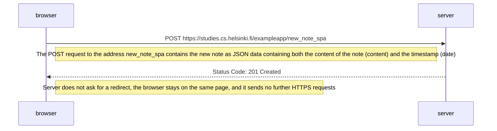

```mermaid
sequenceDiagram 
    participant browser
    participant server

    browser->>server: POST https://studies.cs.helsinki.fi/exampleapp/new_note_spa

    Note right of browser: The POST request to the address new_note_spa contains the new note as JSON data containing both the content of the note (content) and the timestamp (date)

    server-->>browser: Status Code: 201 Created

     Note right of browser: Server does not ask for a redirect, the browser stays on the same page, and it sends no further HTTPS requests
```